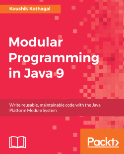

# Modular Programming in Java 9

This repository is a study of modular Java 9. It's based on the book [Modular Programming in Java](https://www.packtpub.com/product/modular-programming-in-java-9/9781787126909)

* 01-one-module-hello-world
* 02-one-module
* 03-two-modules
* 05-jdk-modules
* 06-readability-accessibility
* 07-services
* 09-module-patterns
* 10-migrating-application
* 11-migrating-application
* 12-build-tools-and-testing

Book Cover \
